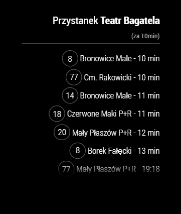

# Module: MMM-CracowMPK for MagicMirror

Module displays in real time the tram departure from selected stop in Cracow (Poland).



## Usage

You need to install the module for your MagicMirror.

### Installation

Navigate into your MagicMirror's modules folder:

```
cd ~/MagicMirror/modules
```

Clone this repository:

```
git clone https://github.com/wkra/MMM-CracowMPK.git
```

Now you nedd to configure module in your config.js file.

### Configuration

To run MMM-CracowMPK module, you need to add the following data to your config.js file.

```
{
  module: 'MMM-CracowMPK',
  position: 'bottom_right', // you may choose any location
  config: {
    stopName: 'Teatr Bagatela', // required
    minutesDelay: 10, // optional
    excludedDirections: ["Os.Piastów", "Kombinat"], // optional
    displayStartHour: 6, // optional
    displayEndHour: 23 // optional
  }
}
```

## Configuration options

The following properties can be configured:

| Option               | Description                                                                                                                                                                                                                 |
| -------------------- | --------------------------------------------------------------------------------------------------------------------------------------------------------------------------------------------------------------------------- |
| `stopName`           | Stop will be search in API by `stopName` You have to fill `stopName` or `stopId`.<br> **Example:** `"Teatr Bagatela"`<br><br> **Default value:** `''`                                                                       |
| `stopId`             | You can use when there is a problem to find correct stop. Go to `http://www.ttss.krakow.pl/` find your stop and copy number of `?stop=` from url. You have to fill `stopName` or `stopId`. <br><br> **Default value:** `-1` |
| `excludedDirections` | If you want to excluded some direction.<br> **Example:** `["Os.Piastów", "Kombinat"]` <br><br>**Default value:** `[]`                                                                                                       |
| `updateInterval`     | Value of update interval in millisecond. <br><br> **Default value:** `60000` (1 minute)                                                                                                                                     |
| `maxLines`           | How much items can be displayed <br><br> **Default value:** `7`                                                                                                                                                             |
| `minutesDelay`       | If you need e.g. 10 minutes to reach the stop. <br><br> **Default value:** `0`                                                                                                                                              |
| `displayStartHour`   | If you do not need to display data around the clock, enter display start hour.<br> **Possible values:** `0-24` <br><br> **Default value:** `0` (Hour)                                                                       |
| `displayEndHour`     | If you do not need to display data around the clock, enter display end hour. <br>**Possible values:** `0-24` <br><br> **Default value:** `24` (Hour)                                                                        |
